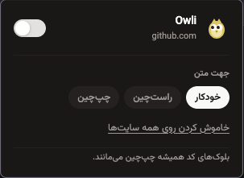

<div dir="rtl" align="right">

# Owli

### اصلاح هوشمند جهت متن‌های فارسی، عربی، انگلیسی و ترکیبی در Firefox

Owli یک افزونه سبک و متن‌باز برای Firefox است که جهت نمایش متن را در صفحات وب به‌صورت هوشمند تشخیص می‌دهد و بدون به‌هم‌ریختن کدها، لینک‌ها، اعداد و رابط کاربری، متن‌های فارسی و عربی را خواناتر می‌کند.

<p>
  
  
  
  
</p>

> متن‌های راست‌به‌چپ و چپ‌به‌راست را در کنار هم، مرتب‌تر و طبیعی‌تر بخوانید.

---

## قابلیت‌ها

- تشخیص خودکار جهت متن‌های فارسی، عربی و لاتین
- پشتیبانی از متن‌های ترکیبی شامل فارسی، انگلیسی، اعداد، لینک‌ها و علائم نگارشی
- سه حالت نمایش: **خودکار**، **راست‌چین** و **چپ‌چین**
- امکان فعال یا غیرفعال‌کردن افزونه برای هر سایت به‌صورت جداگانه
- کلید روشن و خاموش سراسری برای همه سایت‌ها
- پشتیبانی از فیلدهای ورودی، textarea و ویرایشگرهای `contenteditable`
- حفظ جهت استاندارد بلوک‌های کد و محتوای فنی
- پشتیبانی از صفحات پویا با استفاده از `MutationObserver`
- رابط کاربری فارسی، مینیمال و سازگار با حالت روشن و تاریک
- ذخیره تنظیمات با `browser.storage.local`
- بدون جمع‌آوری یا ارسال اطلاعات کاربر

---

##  پیش‌نمایش

<p align="center">
  
</p>

---

##  نصب برای توسعه

1. مخزن را دریافت کنید:

```bash
git clone https://github.com/Qarebaq/owli.git
cd owli
```

2. در Firefox نشانی زیر را باز کنید:

```text
about:debugging#/runtime/this-firefox
```

3. روی **Load Temporary Add-on** کلیک کنید.

4. فایل `manifest.json` پروژه را انتخاب کنید.

افزونه تا زمان بسته‌شدن Firefox به‌صورت موقت فعال می‌ماند.

---

##  ساخت فایل قابل انتشار

محتویات اصلی افزونه را zip کنید؛ خود پوشه والد نباید داخل فایل نهایی باشد:

```bash
zip -r owli-firefox.zip \
  manifest.json \
  content.js \
  content.css \
  popup \
  icons
```

فایل ساخته‌شده را می‌توان برای بررسی در Firefox Add-ons ارسال کرد.

---

##  نحوه استفاده

1. افزونه را نصب کنید.
2. روی آیکون Owli در نوار ابزار Firefox کلیک کنید.
3. حالت جهت متن را انتخاب کنید:
   - **خودکار:** جهت هر متن را براساس محتوای آن تشخیص می‌دهد.
   - **راست‌چین:** تمام بلوک‌های قابل پردازش را راست‌چین می‌کند.
   - **چپ‌چین:** تمام بلوک‌های قابل پردازش را چپ‌چین می‌کند.
4. با کلید بالای پنجره، افزونه را فقط برای سایت فعلی فعال یا غیرفعال کنید.
5. از گزینه پایین پنجره برای روشن یا خاموش‌کردن سراسری افزونه استفاده کنید.

---

##  نحوه عملکرد

Owli روی بلوک‌های واقعی متن مانند پاراگراف‌ها، عنوان‌ها، آیتم‌های لیست و سلول‌های جدول کار می‌کند. در حالت خودکار، اولین نویسهٔ قوی فارسی، عربی یا لاتین را تشخیص می‌دهد و برای نمایش طبیعی متن از `dir="auto"` استفاده می‌کند.

برای جلوگیری از خراب‌شدن محتوای فنی، عناصر زیر پردازش نمی‌شوند یا جهت چپ‌به‌راست خود را حفظ می‌کنند:

```text
pre, code, kbd, samp, svg, math, script, style, select, option
```

در صفحات پویا نیز تغییرات DOM مشاهده می‌شوند تا محتوایی که بعداً به صفحه اضافه شده است پردازش شود.

---

##  ساختار پروژه

```text
owli/
├── manifest.json
├── content.js
├── content.css
├── icons/
│   ├── icon-16.png
│   ├── icon-32.png
│   ├── icon-48.png
│   └── icon-96.png
└── popup/
    ├── popup.html
    ├── popup.css
    └── popup.js
```

| فایل | کاربرد |
|---|---|
| `manifest.json` | تعریف افزونه، مجوزها، آیکون‌ها و Content Script |
| `content.js` | تشخیص و اعمال جهت متن در صفحات وب |
| `content.css` | قوانین مربوط به RTL، LTR و محتوای فنی |
| `popup/popup.html` | ساختار رابط پنجره افزونه |
| `popup/popup.css` | طراحی، حالت تاریک و اجزای رابط |
| `popup/popup.js` | مدیریت تنظیمات سایت، حالت نمایش و ذخیره‌سازی |

---

##  حریم خصوصی

Owli:

- داده‌ای از صفحات وب جمع‌آوری نمی‌کند.
- هیچ اطلاعاتی را به سرور خارجی ارسال نمی‌کند.
- از سرویس تحلیل رفتار یا تبلیغات استفاده نمی‌کند.
- تنظیمات را فقط به‌صورت محلی در مرورگر ذخیره می‌کند.

مجوز `<all_urls>` فقط برای اجرای اصلاح جهت متن روی سایت‌هایی است که کاربر باز می‌کند.

> نکته: فونت رابط Popup در نسخه فعلی از Google Fonts دریافت می‌شود. برای انتشار کاملاً آفلاین، بهتر است فونت به‌صورت محلی داخل پروژه قرار گیرد یا از فونت‌های سیستمی استفاده شود.

---

## فناوری‌های استفاده‌شده

- JavaScript بدون فریم‌ورک
- HTML و CSS
- WebExtensions API
- Firefox Manifest V3
- `browser.storage.local`
- `MutationObserver`
- Unicode Bidirectional Algorithm

---

##  مشارکت

مشارکت‌ها، پیشنهادها و گزارش باگ‌ها خوش‌آمدند.

1. پروژه را Fork کنید.
2. یک Branch جدید بسازید:

```bash
git checkout -b feature/my-feature
```

3. تغییرات را Commit کنید:

```bash
git commit -m "feat: add my feature"
```

4. Branch را Push کرده و Pull Request بسازید.

برای گزارش باگ، بهتر است موارد زیر را بنویسید:

- نسخه Firefox
- آدرس یا نوع سایتی که مشکل در آن رخ داده است
- حالت انتخاب‌شده در افزونه
- مراحل بازتولید مشکل
- تصویر یا ویدیوی کوتاه از رفتار نادرست

---

##  مسیر توسعه پیشنهادی

- [ ] صفحه تنظیمات مستقل
- [ ] لیست استثناها برای دامنه‌ها
- [ ] همگام‌سازی تنظیمات بین دستگاه‌ها
- [ ] میان‌بر صفحه‌کلید برای تغییر حالت
- [ ] پشتیبانی از Import و Export تنظیمات
- [ ] تست خودکار برای تشخیص جهت متن
- [ ] انتشار در Firefox Add-ons
- [ ] محلی‌سازی رابط برای زبان‌های دیگر

---

##  مجوز

این پروژه تحت مجوز MIT منتشر می‌شود. برای استفاده عمومی، فایل `LICENSE` را به ریشه پروژه اضافه کنید.

---

<p align="center">
  ساخته‌شده برای خواندن بهتر وب چندزبانه 
</p>

</div>
